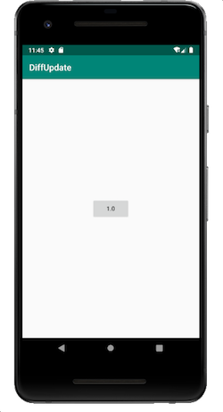
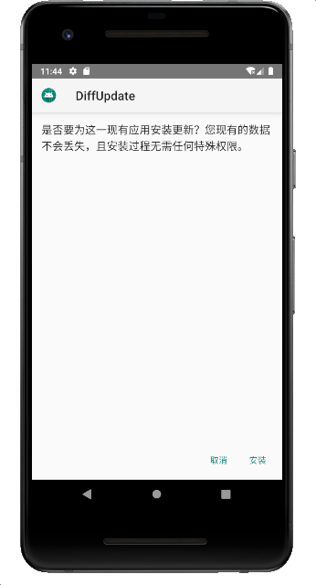

### 准备工作：
> 增量更新开源库：[http://www.daemonology.net/bsdiff/](http://www.daemonology.net/bsdiff/)<br>
> bsdiff还依赖bzip2: [https://sourceforge.net/projects/bzip2]
### 1. 快速集成：
```groovy
allprojects {
    repositories {
        maven { url 'https://jitpack.io' }
    }
}

dependencies {
    implementation 'com.github.andnux.android:libbspatch:1.0.9'
}

使用：Bspatch.bspatch(String oldFile, String newFile, String patchFile);
```
### 2. 自己实现:
#### 拷贝源码：
   blocksort.c bspatch.c  bzip2.c bzip2recover.c bzlib_private.h bzlib.c
   bzlib.h compress.c crctable.c decompress.c huffman.c randtable.c
#### 编写CMakeLists.txt：
```
cmake_minimum_required(VERSION 3.2)
include_directories(src/main/cpp)
file(GLOB CPP src/main/cpp/*.c)
add_library(bspatch SHARED ${CPP})
target_link_libraries(bspatch log)
```
#### 编写native接口
```
public class Bspatch {
    static {
        try {
            System.loadLibrary("bspatch");
        } catch (Exception e) {
            e.printStackTrace();
        }
    }
    public native static int bspatch(String oldFile, String newFile, String patchFile);
}
```

#### 实现native接口
1. 同样的把main函数改为bspatch_main，并在顶部加入 #include <jni.h>和修改#include "bzlib.h"
2. 在bspatch.c 最后加入以下代码。
```
JNIEXPORT jint JNICALL
Java_top_andnux_diffupdate_Bspatch_bspatch(JNIEnv *env, jclass type, jstring oldFile_,
                                           jstring newFile_, jstring patchFile_) {
    const char *oldFile = (*env)->GetStringUTFChars(env, oldFile_, 0);
    const char *newFile = (*env)->GetStringUTFChars(env, newFile_, 0);
    const char *patchFile = (*env)->GetStringUTFChars(env, patchFile_, 0);
    int argc = 4;
    const char *argv[4];
    argv[0] = "bspatch";
    argv[1] = oldFile;
    argv[2] = newFile;
    argv[3] = patchFile;
    int ret = 0;
    ret = bspatch_main(argc, (char **) argv);
    (*env)->ReleaseStringUTFChars(env, oldFile_, oldFile);
    (*env)->ReleaseStringUTFChars(env, newFile_, newFile);
    (*env)->ReleaseStringUTFChars(env, patchFile_, patchFile);
    return ret;
}
```
#### 编译
1. 添加权限
```
    <uses-permission android:name="android.permission.INTERNET" />
    <uses-permission android:name="android.permission.WRITE_EXTERNAL_STORAGE" />
    <uses-permission android:name="android.permission.READ_EXTERNAL_STORAGE" />
```
2. 编写下载和安装代码
```
public static void installPatch(final Activity activity, final File patchFile) {
        final String path = activity.getPackageResourcePath();
        new Thread() {
            @Override
            public void run() {
                super.run();
                File directory = Environment.getExternalStoragePublicDirectory(
                        Environment.DIRECTORY_DOWNLOADS);
                final File file = new File(directory, System.currentTimeMillis() + ".apk");
                Bspatch.bspatch(path, file.getAbsolutePath(), patchFile.getAbsolutePath());
                activity.runOnUiThread(new Runnable() {
                    @Override
                    public void run() {
                        install(activity, file);
                }
            });
        }
    }.start();
}
```
3. 运行结果<br>





#### 结束语
关于APP端的增量更新就到此结束，如有疑问请到github查看源码。<br>
附GitHub [https://github.com/andnux/DiffUpdate]